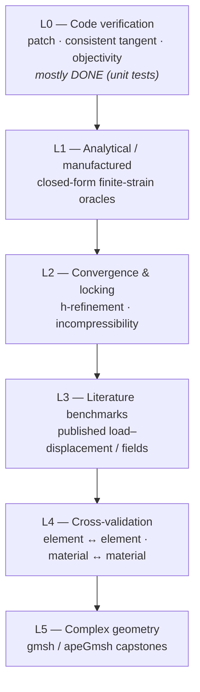
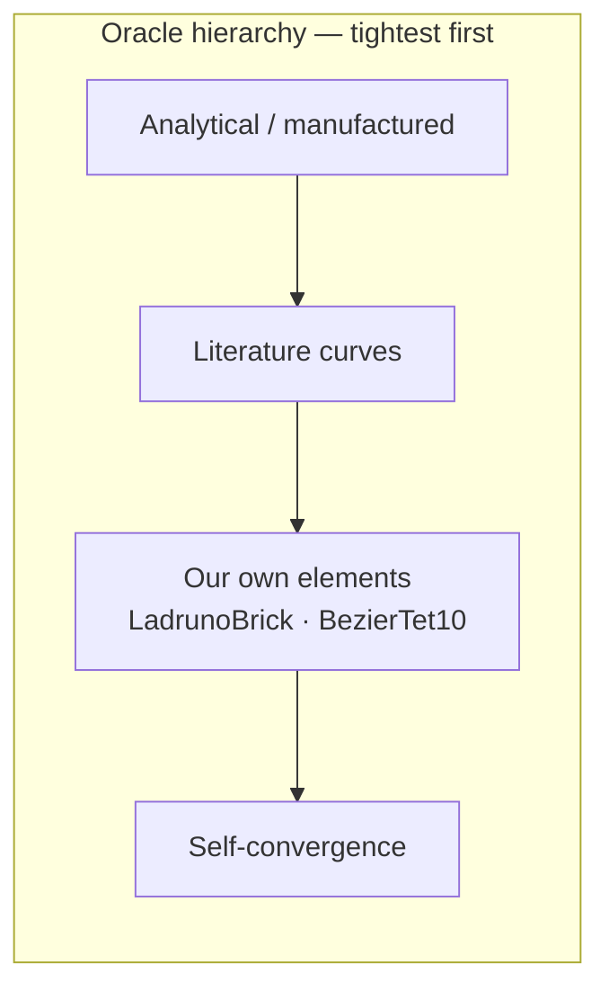
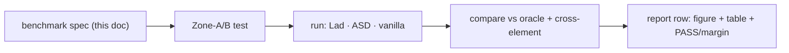

# Validation Plan — the Finite-Strain Trifecta

> [!abstract] What this document is
> A multi-level **verification & validation (V&V)** plan for the finite-strain
> "trifecta" shipped on `ladruno`:
> 1. the **material wrapper** — [[09_finite_strain_material_wrapper|LogStrainNDMaterial]] (Hencky/MATISU adaptor) + `FiniteStrainNDMaterial` base;
> 2. the **element wrapper** — [[10_solid_corotational_adr|SolidTransformation]] with `-geom linear | corot | finite`;
> 3. the **element** — [[09_ladruno_brick|LadrunoBrick]] (8-node hex, `-formulation std | bbar | uri | eas`).
>
> It scopes *what* to test, *why* (the theory), *against what oracle*, and *to what
> tolerance* — across analytical solutions, literature benchmarks, and our own
> fork elements. It is a **plan**, not code: each benchmark row is a contract a
> future Zone-A/Zone-B test will fulfil.

Companion docs: [[09_ladruno_brick]], [[10_solid_corotational_adr]], [[09_finite_strain_material_wrapper]], [[10_ladruno_j2_plasticity]], [[16_finite_native_j2_adr]], [[14_bezier_tet10_corot]], [[ladruno_apegmsh_contract]], `testbed/00_canonical_testbed`.

---

## 1. Scope & the capability/boundary matrix

The trifecta delivers **geometric + material nonlinearity for 3D solids** by three
composable axes. Validation must exercise each axis *and their interactions*.

| Axis | Options | What it adds |
|---|---|---|
| **Geometry** (`-geom`) | `linear` · `corot` · `finite` | small strain → large rotation/small strain → large strain (multiplicative) |
| **Formulation** | `std` · `bbar` · `uri` · `eas` | plain → volumetric-locking cure → reduced-int+hourglass → enhanced-strain |
| **Material** (inner) | Ladruno · ASDPlastic · vanilla | the constitutive law, wrapped by `LogStrain` for `finite` |

### In scope (this phase)

- [x] **Finite-strain plasticity** — `finite` + `LogStrain` + J2/Drucker–Prager: necking, upsetting, large plastic strain.
- [x] **Large rotation** — `corot`: cantilevers, elastica, buckling/snap-through (small material strain).
- [x] **Locking / near-incompressibility** — `bbar`/`eas`/F-bar under finite strain: isochoric J2, rubber-like, Cook's membrane.
- [x] **Explicit dynamics** — `CentralDifferenceLadruno` / `ExplicitBathe` + `finite`: wave propagation, Taylor-bar impact.

### Explicit non-goals (do **not** validate / claim)

> [!warning] The §14.11 boundary
> **Combined (kinematic) hardening is NOT objective under large rotation in the v1
> `LogStrain`-over-`LadrunoJ2` path** — the de Souza Neto §14.11 limit, pinned as a
> strict xfail. See [[16_finite_native_j2_adr]]. Validation of large-rotation
> finite-strain plasticity therefore uses **isotropic hardening** inner laws.
> Combined hardening is validated only in the **small-rotation finite** and
> **corot** regimes (where it *is* objective — verified, `test_corot_kinematic_hardening_objectivity`).

Out of scope here: contact, thermal coupling, rate-dependent viscoplasticity, fracture/XFEM.
<!-- Was: [[11_ladruno_contact|scoped, unbuilt]] — stale on both counts as of 2026-08-23.
     Contact was neither numbered 11 nor left unbuilt: it shipped as
     [[39_ladruno_contact_domain_adr|ADR 39]] and the ADR-85 2D lane. It remains out of
     scope *for this validation plan*, which is what the sentence is asserting. -->
Contact has since shipped ([[39_ladruno_contact_domain_adr|ADR 39]]) and is validated on its
own track; it is still out of scope for *this* plan. ASDConcrete crack-band validation is its own track ([[11_brick_asdconcrete_integration]]).

---

## 2. The V&V hierarchy

We follow the standard **verification-before-validation** discipline (Roache;
ASME V&V 10): *code verification* (is the math implemented right?) precedes
*solution verification* (is the discretization converged?) precedes *validation*
(does it match reality / accepted references?).



| Level | Question answered | Oracle | Tolerance band | Zone |
|---|---|---|---|---|
| **L0** | Is the element/material *self-consistent*? | exact identities (FD tangent, rigid rotation) | $10^{-6}$–$10^{-9}$ | A |
| **L1** | Does it match *closed-form* physics? | analytical / manufactured | $10^{-3}$–$10^{-6}$ | A |
| **L2** | Is the *discretization* converged & locking-free? | self (Richardson) + analytical | rate $p\approx2$; locking ratio | A |
| **L3** | Does it match *accepted references*? | published curves/fields | 1–5 % | A (struct) / B (meshed) |
| **L4** | Do *independent implementations* agree? | our elements & materials | $10^{-3}$–2 % | A/B |
| **L5** | Does it work on *real geometry*? | self-convergence + L3 refs | engineering (≤5 %) | B |

> [!note] What L0 already covers (do not duplicate)
> Existing unit tests already establish L0 for the supported regimes: consistent
> tangent vs FD (`test_finite_consistent_tangent_matches_finite_difference`,
> `test_corot_tangent_gap_vanishes_with_strain`), rigid-rotation objectivity
> (`*_rigid_rotation_is_stress_free`), reduce-to-linear, homogeneous patch, F-bar
> volumetric-locking relief, and the Box-14.4 oracle match
> (`test_finite_j2_*_matches_oracle`). **This plan starts at L1.**

---

## 3. Theory foundation (the math the validation rests on)

### 3.1 Kinematics & the multiplicative split

The deformation gradient $\mathbf{F}=\partial\mathbf{x}/\partial\mathbf{X}$, $J=\det\mathbf{F}>0$,
polar-decomposes as $\mathbf{F}=\mathbf{R}\,\mathbf{U}=\mathbf{V}\,\mathbf{R}$.
For finite-strain plasticity we use the **multiplicative split**
$\mathbf{F}=\mathbf{F}^e\mathbf{F}^p$ and the **logarithmic (Hencky) strain**

$$
\boldsymbol{\varepsilon}^e=\tfrac12\ln\mathbf{b}^e,\qquad
\mathbf{b}^e=\mathbf{F}^e\mathbf{F}^{eT}.
$$

The MATISU spatial update (dSNPO Box 14.3) the wrapper implements:

$$
\mathbf{b}^{e,\mathrm{tr}}=\mathbf{f}_\Delta\,\mathbf{b}^e_n\,\mathbf{f}_\Delta^T,\quad
\mathbf{f}_\Delta=\mathbf{F}_{n+1}\mathbf{F}_n^{-1},\quad
\boldsymbol{\varepsilon}^{e,\mathrm{tr}}=\tfrac12\ln\mathbf{b}^{e,\mathrm{tr}},
$$

then the **unchanged small-strain return map** on $\boldsymbol{\varepsilon}^{e,\mathrm{tr}}$
returns Kirchhoff stress $\boldsymbol{\tau}$, and finally

$$
\boldsymbol{\sigma}=J^{-1}\boldsymbol{\tau}\ \text{(Cauchy)},\qquad
\mathbf{c}=\frac{1}{2J}\big[\mathbf{D}:\mathbf{L}:\mathbf{B}\big]\ \text{(spatial modulus, §14.5)}.
$$

> [!tip] Why each L0/L1 test exists
> - **Rigid rotation $\Rightarrow$ zero stress** tests $\boldsymbol{\varepsilon}^{e,\mathrm{tr}}$ frame indifference ($\|\mathbf{Q}\,\mathbf{s}\,\mathbf{Q}^T\|=\|\mathbf{s}\|$).
> - **Uniaxial/equibiaxial patch** tests the $\ln$ spectral map *including repeated eigenvalues* (the A.52/A.53 degeneracy branch).
> - **Large-$J$ dilatation** tests the $\boldsymbol{\sigma}=J^{-1}\boldsymbol{\tau}$ and $\tfrac{1}{2J}$ factors away from $J\approx1$.

### 3.2 Element equilibrium & the geometric tangent

The internal force and consistent tangent (updated-Lagrangian) are

$$
\mathbf{f}^{\mathrm{int}}=\int_v \mathbf{B}^T\boldsymbol{\sigma}\,dv,\qquad
\mathbf{K}=\underbrace{\int_v \mathbf{B}^T\mathbf{c}\,\mathbf{B}\,dv}_{\text{material}}
+\underbrace{\int_v \mathbf{G}^T\boldsymbol{\Sigma}\,\mathbf{G}\,dv}_{K_{\text{geo}}},
$$

with the geometric term $a_{ijkl}=c_{ijkl}-\sigma_{il}\delta_{jk}$ **owned by the element**
(the material returns only the constitutive part). The `corot` path instead strips
$\mathbf{R}=\mathrm{polar}(\mathbf{H})$ and globalizes the core-frame force/stiffness,
adding the rotation-induced geometric stiffness (EICR).

### 3.3 Plastic incompressibility (a free analytical oracle)

J2 (von Mises) plastic flow is isochoric: $\det\mathbf{F}^p=1\Rightarrow
\det\mathbf{b}^e=J^2$ and $\operatorname{tr}\boldsymbol{\varepsilon}^e=\ln J$.
Any finite-strain J2 run must satisfy this **at every step** — a built-in solution check.

### 3.4 Locking & its cures

- **Volumetric locking** ($\nu\to1/2$ or isochoric plasticity): cured by **B-bar**
  (mean-dilatation) and **F-bar** (dSNPO Ch.15, $\bar{\mathbf{F}}=(J_0/J)^{1/3}\mathbf{F}$)
  and **EAS** (enhanced volumetric modes). Validated by the *limit* $\nu\to0.5$.
- **Shear locking** (bending with low-order hex): cured by EAS / assumed strain
  (`uri`+physical hourglass). Validated by slender bending.

### 3.5 Convergence

For a smooth solution the FE error obeys $\|e\|_{L^2}\le C\,h^{p+1}$,
$\|e\|_{\text{energy}}\le C\,h^{p}$; an 8-node hex gives displacement order $p=2$.
**Solution verification** = demonstrating the observed rate matches $p$ (Richardson).



---

## 4. Materials under test

Per the directive: **use Ladruno materials *and* ASDPlastic (both encouraged); fall
back to vanilla where it adds an independent oracle.** Wrapping each inner in
`LogStrain` for the `finite` path means every finite benchmark simultaneously
validates *the wrapper* and *the inner law's consistency through it*.

| Material | Command (sketch) | Role | Regimes |
|---|---|---|---|
| **LadrunoJ2** | `nDMaterial LadrunoJ2 $t $K $G -iso voce … [-kin N …]` | primary finite/corot plasticity (iso for large-rot) | all |
| **LadrunoUniaxialJ2** | `uniaxialMaterial LadrunoUniaxialJ2 …` | 1D cross-check / fiber (not solid) | aux |
| **ASDPlasticMaterial3D** | `nDMaterial ASDPlasticMaterial3D $t … VonMises…` | **independent return-map oracle** (von Mises + DP) | all |
| **J2Plasticity** (vanilla) | `nDMaterial J2Plasticity $t $K $G $sy $sy 0 $H` | reduction/cross-check, isotropic only | small-rot, corot |
| **DruckerPrager** (vanilla) | `nDMaterial DruckerPrager …` | pressure-dependent cross-check | finite |
| **ElasticIsotropic** | `nDMaterial ElasticIsotropic $t $E $nu` | via `LogStrain` ⇒ Hencky hyperelasticity; reductions | all |

> [!note] ASDPlastic configuration caveat
> `ASDPlasticMaterial3D` uses an expanded `iv_type` dispatch string (e.g.
> `EpsQpShear(StiffSoilShearHardening):`). **Pin the exact von-Mises / Drucker–Prager
> config strings by enumerating** `ops.nDMaterial('ASDPlasticMaterial3D', 999, 'list')`
> before authoring tests (see the ASDPlastic dispatch note). Calibrate ASDPlastic and
> LadrunoJ2 to the **same** $E,\nu,\sigma_y,H$ so cross-validation is apples-to-apples.

> [!important] Finite needs LogStrain; corot/linear use the bare material
> `-geom finite` requires a `FiniteStrainNDMaterial` — wrap any inner as
> `nDMaterial LogStrain $t $innerTag` (parser now enforces both directions). `corot`
> and `linear` drive the bare small-strain material via `setTrialStrain`.

---

## 5. The benchmark catalog

> Column legend — **G**: geom (`L`/`C`/`F`); **Form**: formulation; **Mat**: material set;
> **QoI**: quantity of interest; **Tol**: acceptance band; **Z**: zone.

### L1 — Analytical / manufactured (exact oracles)

| ID | Problem | G | Form | Mat | QoI | Oracle | Tol | Z |
|---|---|---|---|---|---|---|---|---|
| **A1** | Uniaxial finite stretch (homogeneous) | F | std | all | $\sigma_{\text{true}}(\lambda)$ | $\sigma=\sigma_y(\bar\varepsilon^p),\ \bar\varepsilon^p=\ln\lambda-\sigma/E$ | $10^{-5}$ | A |
| **A2** | Equibiaxial / **hydrostatic** stretch (degenerate eigenvalues) | F | std/bbar | Elastic,J2 | Cauchy field | closed-form Hencky; **repeated-λ branch** | $10^{-5}$ | A |
| **A3** | Large dilatation $J\in[0.5,2]$ | F | bbar | Elastic | $\sigma,\,c$ scaling | $\sigma=J^{-1}\tau$, $\operatorname{tr}\varepsilon=\ln J$ | $10^{-5}$ | A |
| **A4** | Finite **simple shear** $\mathbf{F}=\mathbf{I}+\gamma\,\mathbf{e}_1\!\otimes\!\mathbf{e}_2$ | F | std | Elastic,J2 | $\sigma(\gamma)$ components | Hencky hyperelastic / J2 closed form | $10^{-4}$ | A |
| **A5** | Plastic incompressibility check (any A1–A4 J2 run) | F | all | J2 | $\det\mathbf{b}^e-J^2$, $\operatorname{tr}\varepsilon^e-\ln J$ | $=0$ | $10^{-9}$ | A |
| **A6** | Thick-walled **cylinder/sphere**, internal pressure, elastoplastic | F | bbar | J2 | limit pressure | Hill: $p_{\lim}=\tfrac{2}{\sqrt3}\sigma_y\ln(b/a)$ | 2 % | A |
| **A7** | Cantilever under **end moment** → rolls to a circle | C | std | Elastic | tip rotation/curvature | elastica: $\kappa=M/EI$, circle at $M{=}2\pi EI/L$ | $10^{-3}$ | A |

> [!figure] Figure A6 — pressurized thick cylinder (quarter model)
> Quarter annulus $a\le r\le b$, plane-strain (or thick 3D slice); symmetry BCs on
> the cut faces; ramped internal pressure to collapse. *(plot: $p$ vs $u_r(a)$ with the
> Hill limit asymptote — add during execution.)*

A1–A5 directly close the **coverage gaps the deep review flagged** (degenerate
stretch, $|J-1|\gg0$, incompressibility) — see [[16_finite_native_j2_adr]] / review TEST-1/2.

### L2 — Convergence & locking

| ID | Problem | G | Form | Mat | QoI | Oracle | Accept | Z |
|---|---|---|---|---|---|---|---|---|
| **B1** | h-convergence to A6/A7 | F/C | bbar | J2/Elastic | error vs $h$ | analytical | rate $p\to2$ | A |
| **B2** | Near-incompressible block $\nu=0.499,0.4999$ | F | std **vs** bbar/eas | Elastic | tip/centre disp | locking ratio | bbar/eas un-lock; std locks | A |
| **B3** | Isochoric J2 block (plastic incompressibility locking) | F | std vs bbar/eas | J2 | limit load | self/analytical | std over-stiff; cures match | A |
| **B4** | **Cook's membrane** (tapered panel), elastoplastic | F | eas/bbar | J2 (Lad+ASD) | tip vertical disp | published converged value | ≤2 % at converged $h$ | A |

> [!figure] Figure B4 — Cook's membrane
> Trapezoidal panel (48×44, tapered 44→16), left edge clamped, right edge shear
> load; classic combined bending+shear+incompressibility locking probe. *(plot:
> tip disp vs DOF for std/bbar/eas — add during execution.)*

### L3 — Literature benchmarks (the citable backbone)

| ID | Problem | G | Form | Mat | QoI | Reference | Tol | Z |
|---|---|---|---|---|---|---|---|---|
| **C1** | **Simo–Armero necking bar** (circular bar, axisymmetric→3D wedge) | F | bbar/eas | J2 iso (Lad+ASD+van) | load–elongation, neck-radius reduction | Simo (1992); dSNPO §14.10 | 3 % | A/B |
| **C2** | **Taylor-bar impact** (copper cylinder → rigid wall) | F | bbar | J2 iso | final length, mushroom radius | Taylor (1948); Kamoulakos | 5 % | B |
| **C3** | **Block upsetting / compression** (with barreling) | F | eas | J2 (Lad+ASD) | force–stroke, barrel profile | dSNPO; Taylor–Becker | 5 % | A/B |
| **C4** | **Large-rotation cantilever** (end load, 90°+ tip) | C | std | Elastic | tip $u,w$ vs load | Bathe–Bolourchi (1979) | 2 % | A |
| **C5** | **Euler column buckling / post-buckling** | C | std | Elastic | critical load, path | $P_{cr}=\pi^2EI/(2L)^2$; elastica | 2 % | A |
| **C6** | **Perforated plate**, in-plane tension, plasticity | F | eas | J2 (Lad+ASD) | load–disp, plastic zone | Zienkiewicz/de Souza Neto | 5 % | B |

> [!figure] Figure C1 — Simo necking bar
> Circular bar $L_0=53.334$ mm, $r_0=6.413$ mm; ends pulled axially; geometric
> imperfection (slight radius taper) seeds the neck. $E=206.9$ GPa, $\nu=0.29$,
> $\sigma_y=0.45$ GPa, saturation hardening. *(plot: reaction vs elongation; neck
> radius vs elongation, overlaid Lad / ASD / vanilla — add during execution.)*

> [!figure] Figure C2 — Taylor bar
> Cu cylinder $L_0=32.4$ mm, $r_0=3.2$ mm, $v_0=227$ m/s into a frictionless rigid
> wall (modelled as a symmetry plane). $\rho,E,\nu,\sigma_y$ per Kamoulakos. QoI:
> final length $L_f$, footprint radius $r_f$. **Flags the explicit-`finite` `dt_cr`
> caveat** (reference-config characteristic length is conservative only until strong
> compression — see review GEOM-2).

### L4 — Cross-validation (independent implementations agree)

This is where the directive "cross-validate to our own elements" lands. Two
independent fork elements consume the **same** material+geometry framework:
**LadrunoBrick** (hex, 8-node) and **[[14_bezier_tet10_corot|BezierTet10]]** (tet, quadratic).
Agreement between *different topology + different order* on the same body is a
strong, code-internal validation.

| ID | Cross-check | Setup | QoI | Accept |
|---|---|---|---|---|
| **D1** | **Formulation agreement** | A-/B-series smooth problems, `std`↔`bbar`↔`eas` | global disp/reaction | ≤$10^{-3}$ (converged) |
| **D2** | **Element agreement** LadrunoBrick ↔ BezierTet10 | C1/C4 on hex mesh vs tet mesh | load–disp curve | ≤2 % (mesh-converged) |
| **D3** | **Material agreement** LadrunoJ2 ↔ ASDPlastic ↔ vanilla J2 | identical calibration on A1/C1/C3 | stress path, limit load | ≤$10^{-3}$ (same return map class) / ≤2 % (ASD) |
| **D4** | **Geometry-method consistency** | C4 cantilever: `corot` ↔ `finite` (small strain) | tip disp | ≤2 % (already spot-checked) |
| **D5** | **Reduction to vanilla solids** | linear/small-strain limit ↔ `stdBrick`/`SSPbrick` | tangent, disp | ≤$10^{-6}$ |

> [!note] Why D2/D3 matter most
> No other OpenSees solid computes $\mathbf{F}$, so finite-strain has **no external
> OpenSees peer**. Cross-validating **hex↔tet** (D2) and **three return maps** (D3)
> through the *same* `LogStrain` wrapper is the strongest internal evidence short of
> a commercial-code oracle.

### L5 — Complex geometry capstones (gmsh / apeGmsh)

| ID | Geometry | G | Form | Mat | QoI | Validation basis | Z |
|---|---|---|---|---|---|---|---|
| **E1** | **Notched bar / SENB**, ductile (finite-strain) | F | eas | J2 (Lad+ASD) | load–CMOD, mesh objectivity | self-convergence + C1 family | B |
| **E2** | **Plate with hole / fillet bracket**, large plastic strain | F | eas | J2 | plastic-zone, load–disp | h-convergence + C6 | B |
| **E3** | **Realistic component** (lug/bracket, STEP→mesh) | F/C | eas | J2 | limit load, deformed shape | self-convergence | B |
| **E4** | **Rubber-like seal** (near-incompressible), large compression | F | bbar/eas | Elastic(Hencky) | force–stroke | analytical limit + B2 | B |

> [!figure] Figure E — apeGmsh capstone workflow
> ```mermaid
> flowchart LR
>   geo["CAD / STEP or parametric"] --> mesh["apeGmsh: hex-dominant<br/>(transfinite + recombine)"]
>   mesh --> fem["FEMData broker"]
>   fem --> bridge["apeSees → LadrunoBrick<br/>-geom finite, LogStrain inner"]
>   bridge --> run["OpenSees solve"]
>   run --> post["Results / .ladruno recorder"]
> ```

---

## 6. Meshing strategy (gmsh / apeGmsh)

LadrunoBrick needs **hexahedra**; BezierTet10 needs **quadratic tets** — both
drivable from [[ladruno_apegmsh_contract|apeGmsh]].

| Need | Approach |
|---|---|
| Structured hex (A/B/C) | gmsh transfinite + `recombine` → hex; or hand-built lattices for patch/convergence |
| Hex-dominant on CAD (E) | gmsh `Recombine3D` / subdivision; fall back to tet+BezierTet10 where hex fails |
| Tet cross-check (D2) | quadratic tets for BezierTet10 ([[bezier_apegmsh_integration]]) |
| Convergence families (B1) | parametric mesh size $h\in\{h_0, h_0/2, h_0/4\}$ via apeGmsh sizing fields |
| Symmetry | quarter/eighth models with symmetry BCs (necking, cylinder, Taylor) |

> [!tip] Zone discipline
> Anything needing gmsh/apeGmsh is **Zone B** (`@pytest.mark.zone_b`, gmsh-gated,
> headless viewer). Structured-lattice versions of the same physics stay **Zone A**
> so the core validation travels with the PR. Several benchmarks appear in *both*
> (a coarse Zone-A lattice + a Zone-B mesh-convergence study).

---

## 7. Quantities of interest & tolerance philosophy

| QoI | Where | Oracle type | Tolerance |
|---|---|---|---|
| Consistent tangent vs FD | L0 | identity | $10^{-6}$ rel |
| Objectivity (rigid rotation) | L0/L1 | identity | $10^{-7}\,E$ |
| Homogeneous stress/strain field | L1 | analytical | $10^{-5}$ |
| Plastic incompressibility | L1 | identity ($=0$) | $10^{-9}$ |
| Limit / collapse load | L1/L3 | analytical / literature | 2–5 % |
| Load–displacement curve | L3/L5 | literature | 1–5 % (RMS over path) |
| Convergence rate $p$ | L2 | Richardson | $p\in[1.8,2.2]$ |
| Field (neck radius, plastic zone) | L3/L5 | literature / self | 3–5 % |
| Energy balance (explicit) | L3 (C2) | $W_{\text{ext}}=W_{\text{int}}+K$ | ≤1 % drift |
| Element ↔ element / material ↔ material | L4 | our own | $10^{-3}$–2 % |

**Philosophy.** Tolerances tighten as the oracle sharpens: machine-ish for identities
and same-return-map cross-checks; engineering for literature curves read off plots;
explicit gets an **energy-balance** gate (via the `EnergyBalanceRecorder`) in addition
to the kinematic QoI.

---

## 8. Acceptance criteria & the validation report

A benchmark **passes** when: (a) the QoI is within tolerance, (b) the analysis
converged (or, for explicit, energy drift ≤1 %), and (c) for convergence cases the
observed rate matches theory. The phase produces a **validation report** (Obsidian,
mirroring this plan) with, per benchmark: problem sketch, mesh, material calibration,
the result table, the overlay figure (ours vs oracle vs cross-element/material), and
pass/fail with the measured margin.



---

## 9. Phased rollout

| Phase | Theme | Benchmarks | Gate |
|---|---|---|---|
| **P1** ✅ | Finite-strain core | A1–A5, B1–B3, **C1** | closes review gaps; necking matches Simo — **DONE**, see [[18_finite_strain_validation_report]] (19 Zone-A tests pass; C1 necking *physics* validated, quantitative ratio→Zone-B) |
| **P2** ✅ | Geometric nonlinearity | A7, C4, C5, D4 | corot elastica/buckling vs analytical — **DONE** (PR #140; 8 tests: A7 elastica arc, C4 vs Mattiasson ≤2.3%, C5 Euler buckling Southwell, D4 corot↔finite) |
| **P3** ✅ | Locking & incompressibility | B2, B4, E4 | F-bar cure demonstrated — **DONE** (PR #141; 4 tests: B4 Cook's membrane converges/std locks, E4 rubber block std/bbar ~9×; B2 already in P1) |
| **P4** ✅ | Explicit dynamics | C2, energy balance | Taylor bar; `dt_cr` caveat documented — **DONE** (PR #143; 4 tests: C2 Taylor bar L_f/L₀=0.67 & mushroom 2.15× vs literature, energy balance, dt_cr reference-config caveat) |
| **P5** ✅ | Cross-validation matrix | D1–D5, A6, C3, C6 | hex↔tet, Lad↔vanilla agree — **DONE** (PR #146; 6 tests: D5 LadrunoBrick≡stdBrick bit-identical, D3 LadrunoJ2≡vanilla J2 bit-identical, D1 std≡bbar off-locking, D2 hex↔tet bracket+converge; D4 in P2. ASDPlastic leg + A6/C3/C6 lit-benchmarks deferred) |
| **P6** | Complex geometry | E1–E3 | apeGmsh capstones, mesh objectivity |

> Recommended start: **P1** (it both closes the deep-review coverage gaps and lands
> the flagship Simo necking benchmark — the single most convincing finite-strain-J2
> validation).

---

## 10. Known limitations carried into the report

> [!warning] State these explicitly in every relevant benchmark
> 1. **Combined-hardening + large rotation** → §14.11 v2 boundary; large-rotation
>    finite plasticity uses **isotropic** hardening only ([[16_finite_native_j2_adr]]).
> 2. **Explicit `-geom finite`** → critical time step uses a **reference-config**
>    characteristic length (conservative only until strong compression; review GEOM-2)
>    — Taylor bar must check/sub-step accordingly.
> 3. **F-bar tangent is unsymmetric** → use an unsymmetric solver for `bbar`+`finite`.
> 4. **`uri`/`eas` are not available under `finite`** (reserved); finite locking
>    cures = `bbar` (F-bar) + (small-rotation) `eas` via corot.

---

## 11. References

- J.C. Simo, *Algorithms for static and dynamic multiplicative plasticity that
  preserve the classical return mapping schemes…*, CMAME 99 (1992).
- E.A. de Souza Neto, D. Perić, D.R.J. Owen, *Computational Methods for Plasticity*
  (2008) — Ch. 14 (finite-strain), §14.10 (necking), Ch. 15 (F-bar).
- G.I. Taylor, *The use of flat-ended projectiles for determining dynamic yield
  stress*, Proc. R. Soc. A (1948); A. Kamoulakos, benchmark data.
- K.J. Bathe, S. Bolourchi, *Large displacement analysis of three-dimensional beam
  structures*, IJNME (1979).
- R.D. Cook, *Improved two-dimensional finite element*, ASCE (1974) — Cook's membrane.
- R. Hill, *The Mathematical Theory of Plasticity* (1950) — thick cylinder/sphere.
- P.J. Roache, *Verification and Validation in Computational Science* (1998);
  ASME V&V 10.

---

## Appendix — figure manifest (to populate during execution)

| Fig | Benchmark | Content |
|---|---|---|
| A6 | thick cylinder | $p$–$u_r(a)$ with Hill limit |
| A7 | end-moment cantilever | deformed shape → circle; $\kappa$–$M$ |
| B4 | Cook's membrane | tip disp vs DOF (std/bbar/eas) |
| C1 | Simo necking | reaction–elongation; neck-radius (Lad/ASD/vanilla overlay) |
| C2 | Taylor bar | deformed mushroom; energy balance vs time |
| C4 | cantilever | $u,w$ tip vs load (corot vs Bathe–Bolourchi) |
| D2 | hex↔tet | overlaid load–disp (LadrunoBrick vs BezierTet10) |
| E* | gmsh capstones | mesh + deformed + mesh-objectivity |
